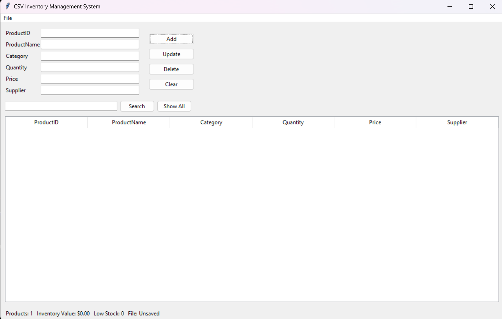
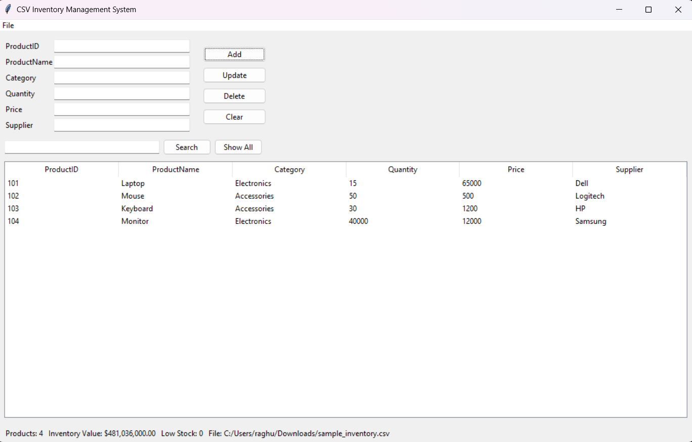
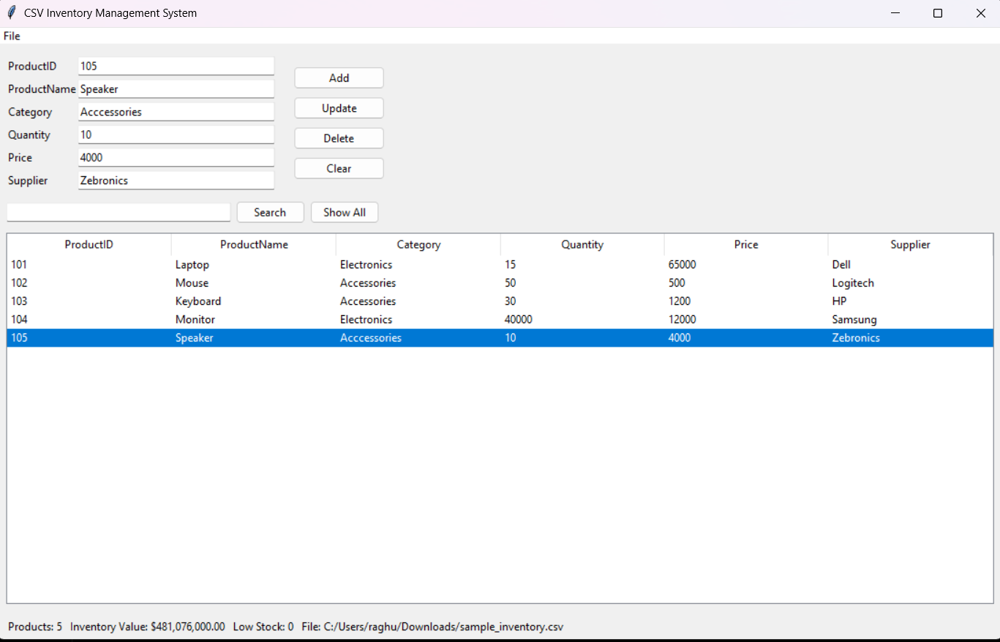

# CSV Inventory Management System

A Python-based desktop **Inventory Management System** developed using **Tkinter** and **CSV file handling**. The application provides a simple graphical interface for managing product records efficiently.

## Project Overview

The **CSV Inventory Management System** is designed to simplify inventory management by allowing users to maintain product information digitally.

The system stores inventory records in CSV files and provides an easy-to-use graphical interface for performing common inventory operations such as adding, updating, deleting, searching, and viewing products.

## Features

* Add new products
* Update existing product records
* Delete products
* Search for products
* View all inventory records
* Create a new inventory file
* Open existing CSV files
* Save inventory data
* Save inventory using **Save As**
* Calculate total number of products
* Calculate total inventory value
* Identify low-stock products
* Clear input fields
* User-friendly graphical interface

The application provides Add, Update, Delete, and Clear controls, along with Search and Show All functionality.

## Screenshots

### Main Interface

The main interface provides the product entry form, inventory table, search functionality, and inventory status information.



### Inventory Data

The inventory table displays product records including Product ID, Product Name, Category, Quantity, Price, and Supplier.



### Search Result

The search feature allows users to quickly find products from the inventory records.



## Product Information

The system manages the following product details:

| Field            | Description                       |
| ---------------- | --------------------------------- |
| **Product ID**   | Unique identifier for the product |
| **Product Name** | Name of the product               |
| **Category**     | Product category                  |
| **Quantity**     | Available quantity                |
| **Price**        | Product price                     |
| **Supplier**     | Supplier information              |

## Technologies Used

* **Python**
* **Tkinter**
* **CSV**
* **Object-Oriented Programming**
* **File Handling**

## Python Libraries

The project uses the following Python modules:

* `tkinter`
* `tkinter.ttk`
* `tkinter.filedialog`
* `tkinter.messagebox`
* `csv`
* `os`

## Requirements

Before running the project, make sure you have:

* **Python 3.x**
* **Tkinter**
* Windows, Linux, or macOS

Tkinter is generally included with standard Python installations.

## How to Run

### 1. Clone the Repository

```bash
git clone YOUR_GITHUB_REPOSITORY_URL
```

### 2. Open the Project Folder

```bash
cd CSV-Inventory-Management-System
```

### 3. Run the Application

```bash
python CSV_Inventory_Manager.py
```

> **Note:** Make sure the Python filename in the command matches the filename in your repository.

## Project Structure

```text
CSV-Inventory-Management-System/
│
├── CSV_Inventory_Manager.py
├── README.md
│
└── screenshots/
    ├── inventory_data.png
    ├── main_interface.png
    └── search_result.png
```

## Inventory Statistics

The application displays important inventory information, including:

* **Total Products**
* **Total Inventory Value**
* **Low Stock Products**
* **Current CSV File**

Inventory value is calculated using:

```text
Quantity × Price
```

Products with a quantity below **5** are identified as low-stock products.

## CSV File Management

The application supports:

* Creating a new inventory file
* Opening existing CSV files
* Saving inventory data
* Saving inventory using **Save As**

## Search Functionality

The search feature allows users to search for products within the inventory.

The application checks the entered search term against the values stored in the inventory records and displays matching results.

## Future Improvements

Possible improvements for future versions include:

* User login and authentication
* Inventory dashboard with charts
* Sorting and advanced filtering
* Stock-in and stock-out tracking
* Better input validation
* Product images
* SQLite or MySQL database integration
* Inventory report generation
* Improved graphical interface

## Author

**Raghu Singh**

---

If you find this project useful, consider giving the repository a star.
